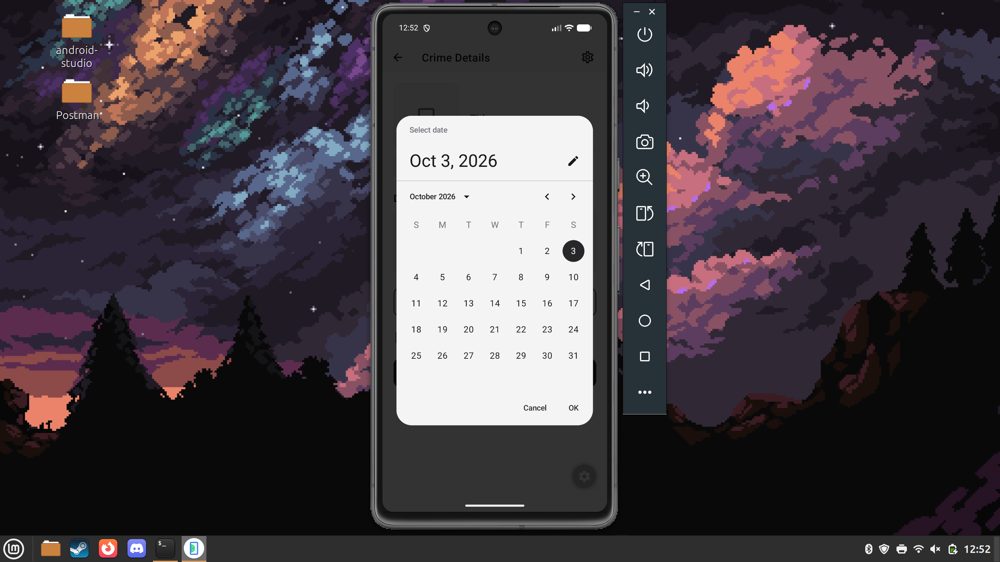
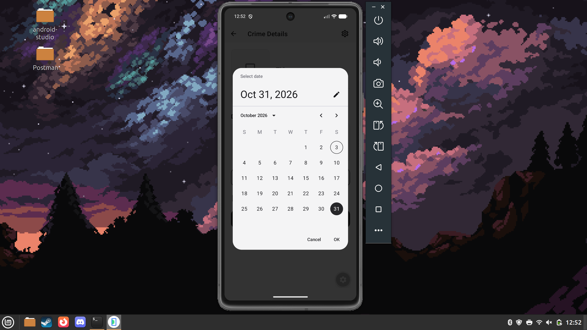
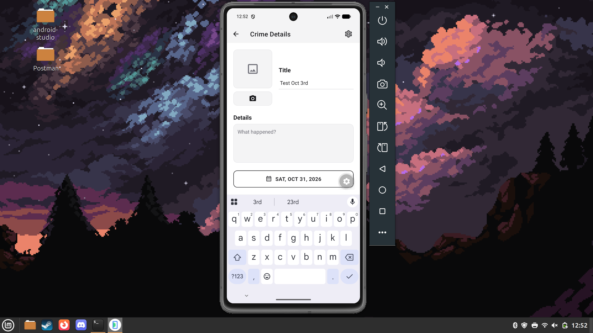
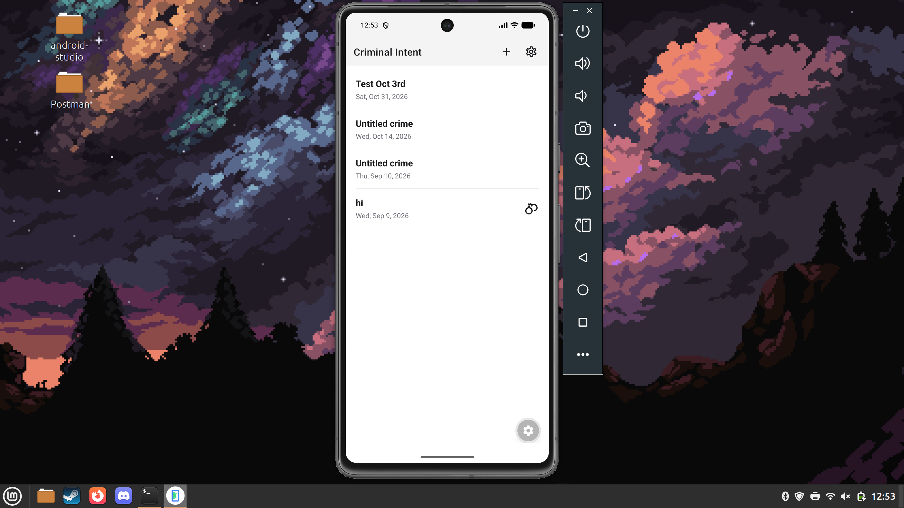

# Criminal Intent

A React Native app built with Expo for tracking office crimes.

**Designed for Android.**

## Features

- Crime list built with a `FlatList`, with a handcuffs icon on solved crimes
- Crime detail screen with a title, details, a date picker, a solved checkbox, and a photo from the camera roll
- Crimes are saved on the device with `expo-sqlite/kv-store`, keyed by UUID; photos are copied into the app's document directory
- Six themes (three light, three dark) shared through React Context and saved on the device

## Date Picker Test

Tested on an Android emulator (Pixel 7, Android 17) in Expo Go. On Android the date button opens the native Material date picker; the first time it opens it can take a few seconds to appear. On iOS it opens a pop-up with the native iOS calendar picker (`DateButton.tsx`), since the Android picker (`DateButton.android.tsx`) can't run on iOS.

1. Pressing the date button opens the date picker on the crime's current date (Oct 3).

   

2. Selecting a new date (Oct 31).

   

3. After pressing OK, the date button shows the new date.

   

4. After saving and going back, the crime list shows the crime with the new date.

   

## Running

```bash
npm install
npx expo start --android
```
